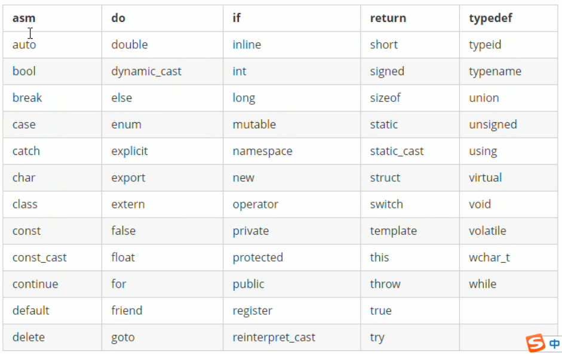

### 注释

- 单行注释     //
- 多行注释    /*   */

### 变量

作用：给一段指定的内存空间起名，方便操作这段内存

语法：数据类型  变量名=初始值

例如：int a = 10

### 常量

作用：用于记录程序中不可更改的数据

C++定义常量的两种方式

1. #define宏常量：#define 常量名  常量值

   - 通常在文件上方定义，表示一个常量

2. const修饰的变量，const 数据类型 常量名 = 常量值

   - 通常在变量定义前加关键字const，修饰该变量为常量，不可修改

   ```c++
   #include <iostream>
   using namespace std;
   
   //常量的定义方式
   //1.#define 宏常量
   //2.const修饰的变量
   
   //1、#define 宏常量
   #define Day 7
   
   int main() {
   
   	cout << "一周总共有：" << Day << "天" << endl;
   
   	//2、const修饰的变量
   	const int month = 12;
   
   	cout << "一年总共有：" << month << "个月" << endl;
   
   	system("pause");
   
   	return 0;
   }
   ```

   

### 关键字

作用：关键字是C++中预先保留的单词（标识符）

- 在定义变量或者常量的时候，不要用关键字

C++关键字如下：



### 标识符命名规则

作用：C++规定给标识符（变量、常量）命名时，有一套自己的规则

- 标识符不能是关键字
- 标识符只能由字母、数字、下划线组成
- 第一个字符必须为字母或下划线
- 标识符中字母区分大小写