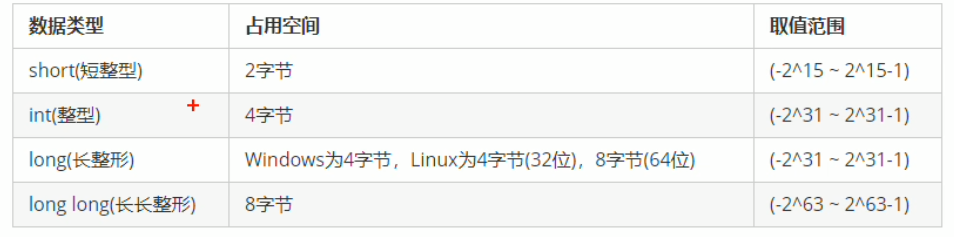
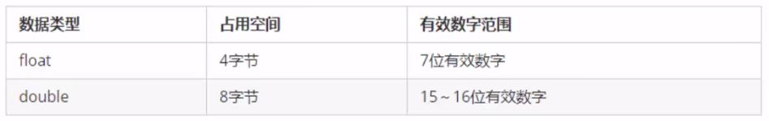

 ### 整型

作用：整型变量表示的是整型类型的数据

C++中能够表示整型的类型有以下几种方式，区别在于所占内存空间不同：



### sizeof关键字

作用：利用sizeof关键字统计数据类型所占内存大小

语法：sizeof（数据类型 / 变量）

```c++
short num1 = 10;
	cout << "short占用内存空间为：" << sizeof(num1) << endl;
```

### 实型（浮点型）

作用：用于表示小数

浮点型变量分为两种：

1. 单精度：float
2. 双精度：double

两者的区别在于表示的有效数字范围不同：



```c++
#include<iostream>
using namespace std;

int main() {

	//1、单精度 float
	//2、双精度 double
	//默认情况下 输出一个小数，会显示出6位有效数字
	float f1 = 3.1415926f;

	cout << "f1 = " << f1 << endl;

	double d1 = 3.1415926;
	cout << "d1 = " << d1 << endl;

	//统计float和double占用内存空间
	cout << "float占用的内存空间为：" << sizeof(f1) << endl;	//4字节
	cout << "double占用的内存空间为：" << sizeof(d1) << endl;	//8字节

	//科学计数法
	float f2 = 3e2; //3 * 10^2
	cout << "f2 = " << f2 << endl;

	float f3 = 3e-2; //3 * 0.1^2
	cout << "f3 = " << f3 << endl;

	system("pause");

	return 0;
}
```

