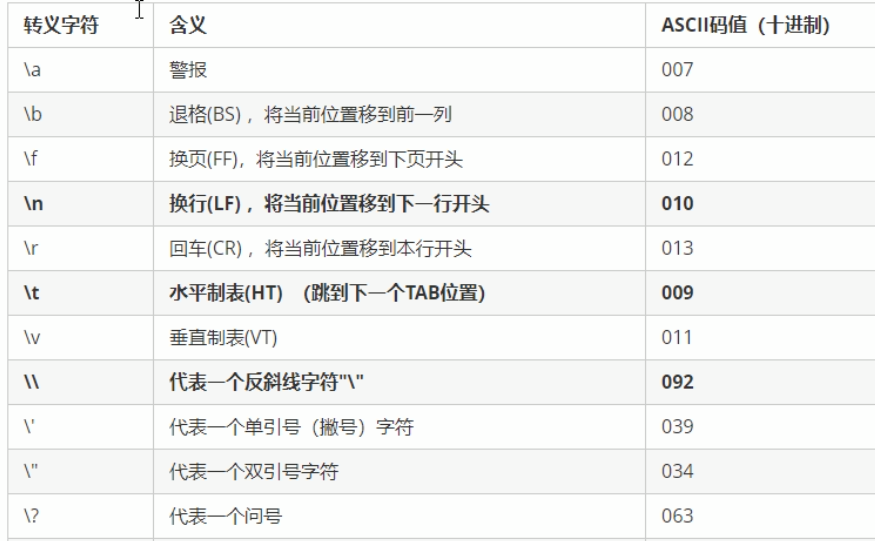

### 字符型

作用：字符型变量用于显示当个字符

语法：char ch = 'a'

> 注意1：在显示字符型变量时，用单引号将字符括起来，不要用双引号
>
> 注意2：单引号内只能有一个字符，不可以是字符串

- C和C++中字符型变量只占用1个字节

### 转义字符

作用：用于表示一些不能显示出来的ASCII字符

常用的转义字符：\n 	\\\	\t

### 字符串型

作用：用于表示一串字符

两种风格

1. C风格字符串：char 变量名[ ] = “字符串值”
2. C++风格字符串：string 变量名 = “字符串值”