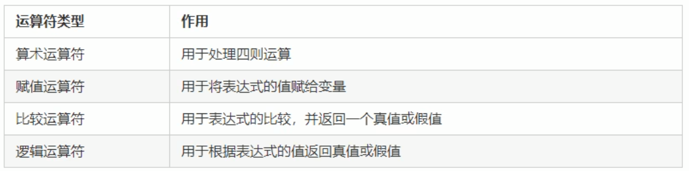
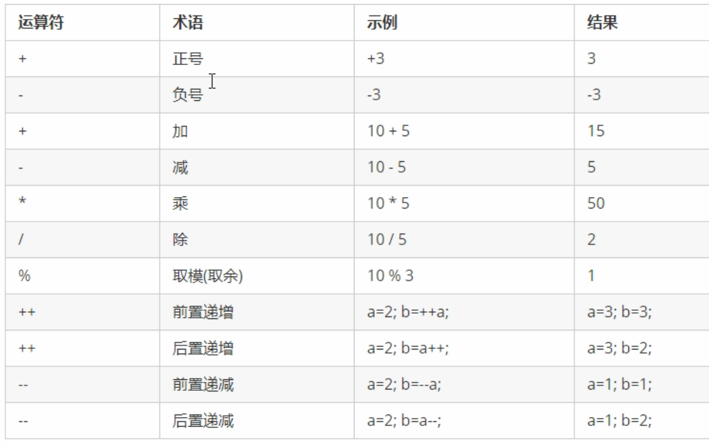
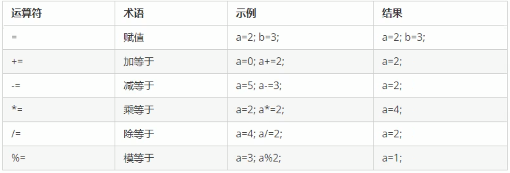
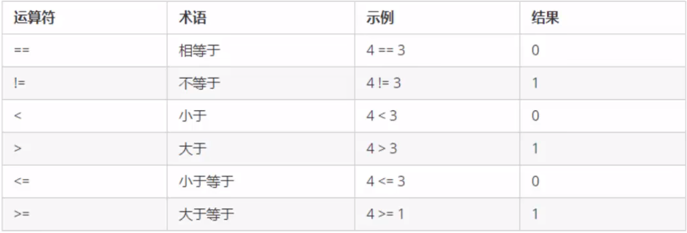
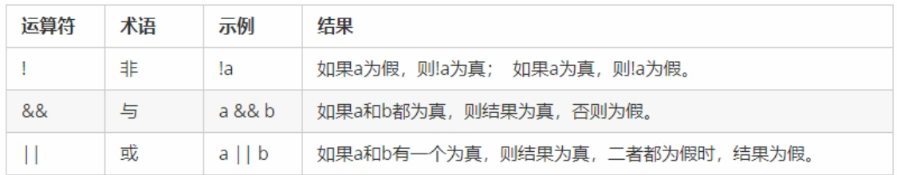

## 运算符

作用：用于执行代码的运算



### 3.1算术运算符

作用：用于处理四则运算



> 注：小数不能做取模（%）运算

前置后置递增递减运算

```c++
#include <iostream>
using namespace std;

int main() {

	//前置（++a）和后置（a++）的区别
	//前置递增 先让变量+1 然后进行表达式运算
	int a1 = 10;
	int b1 = ++a1 * 10;
	cout << "a1 = " << a1 << endl;		//a1 = 11
	cout << "b1 = " << b1 << endl;		//b1 = 110

	//后置递增 先进行表达式运算 后再让变量+1
	int a2 = 10;
	int b2 = a2++ * 10;
	cout << "a2 = " << a2 << endl;		//a2 = 11
	cout << "b2 = " << b2 << endl;		//b2 = 100

	//前置后置递减同理

	system("pause");

	return 0;
}
```

### 3.2 赋值运算符

作用：用于表达式的值赋给变量



### 3.3 比较运算符

作用：用于表达式的比较，并返回一个真值或假值



### 3.4 逻辑运算符

作用：用于根据表达式的值返回真值或假值

