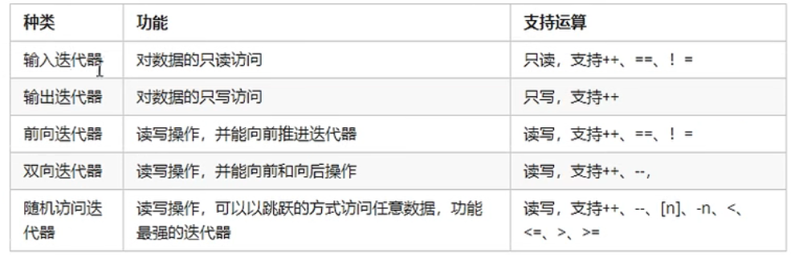

### 03 STL中容器、算法、迭代器

**容器：**

STL容器就是将运用最广泛的数据节后实现出来

常用的数据结构：数组，链表，树，栈，队列，集合，映射表等

这些容器分为序列式容器和关联式容器两种：

- 序列式容器：强调值的排序，序列式容器中的每个元素均有固定的位置
- 关联式容器：二叉树结构，各元素之间没有严格的物理上的顺序关系

**算法：**

算法分为：质变算法和非质变算法

- 质变算法：是指运算过程中会更改区间内的元素的内容，例如拷贝，替换，删除等等
- 非质变算法：是指算法过程中不会更改区间的元素内容，例如查找，计数，遍历，寻找极值等等

**迭代器：**

提供一种方法，使之能够依序寻访某个容器所含的各个元素，而又无需暴露改内容的内部表示方式。

迭代器使用非常类似于指针

迭代器种类：

常用的容器中迭代器种类为双向迭代器或随机访问迭代器