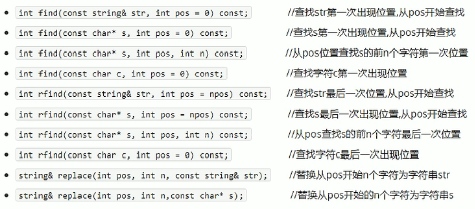
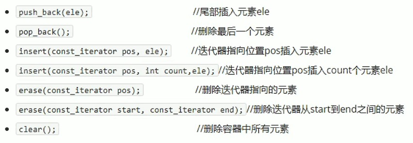

## 3.1 string容器

### 3.1.1 string常用容器

本质：

- string是C++风格的字符串，而string本质上是一个类

**string和char * 区别**

- char * 是一个指针
- string 是一个类，类内部封装了char * ，管理这个字符串，是一个char * 型的容器

**特点：**

string类内部封装了很多成员方法

例如：查找find，拷贝copy，删除delete，替换replace，插入insert

string管理char * 所分配的内存，不用担心复制越界和取值越界等，由类内部负责

### 3.1.2 string构造函数

构造函数原型：

- string（）；							 //创建一个空的字符串，例如：string str；

  string（const char* s）；		//使用字符串s初始化

- string（const string& str）；   //使用一个string对象初始化另一个string对象（拷贝构造）

- string（int n，char c）；         //使用n个字符c初始化

**示例：**

```c++
#include<iostream>
using namespace std;

void test01()
{
	string s1;	//默认构造

	const char* str = "hello world";
	string s2(str);
	cout << "s2 = " << s2 << endl;

	string s3(s2);
	cout << "s3 = " << s3 << endl;

	string s4(10, 'a');
	cout << "s4 = " << s4 << endl;
}

int main(){
	
	test01();
	
	system("pause");
	
	return 0;
}
```

### 3.1.3 string赋值操作

赋值的函数原型：

- string& operator=(const char* s);          //char*类型字符串 赋值给当前的字符串
- string& operator=(const string& s);       //把字符串s赋给当前的字符串
- string& operator=(char c);                     //字符赋值给当前的字符串
- string& assign(const char* s);               //把字符串s赋给当前的字符串
- string& assign(const char* s,int n);       //把字符串s的前n个字符串赋给当前的字符串
- string& assign(const string& s);            //把字符串s赋给当前字符串
- string& assign(int n,char c);                  //用n个字符c赋给当前字符串

**示例：**

```c++
#include<iostream>
using namespace std;

//string赋值操作
//-string & operator=(const char* s);          //char*类型字符串 赋值给当前的字符串
//-string & operator=(const string & s);       //把字符串s赋给当前的字符串
//-string & operator=(char c);                     //字符赋值给当前的字符串
//-string & assign(const char* s);               //把字符串s赋给当前的字符串
//-string & assign(const char* s, int n);       //把字符串s的前n个字符串赋给当前的字符串
//-string & assign(const string & s);            //把字符串s赋给当前字符串
//-string & assign(int n, char c);                  //用n个字符c赋给当前字符串

void test02()
{
	string str1;
	str1 = "hello world";
	cout << "str1 = " << str1 << endl;

	string str2;
	str2 = str1;
	cout << "str2 = " << str2 << endl;

	string str3;
	str3 = 'a';
	cout << "str3 = " << str3 << endl;

	string str4;
	str4.assign("hello C++");
	cout << "str4 = " << str4 << endl;

	string str5;
	str5.assign("hello C++", 5);
	cout << "str5 = " << str5 << endl;

	string str6;
	str6.assign(str5);
	cout << "str6 = " << str6 << endl;

	string str7;
	str7.assign(5, 'a');
	cout << "str7 = " << str7 << endl;
}

int main(){
	
	test02();
	
	system("pause");
	
	return 0;
}
```

### 3.1.4 string字符串拼接

函数原型：

- string& operator+=(const char* str);          //重载+=操作符
- string& operator+=(const char c);             //重载+=操作符
- string& operator+=(const string& str);       //重载+=操作符
- string& append(const char* s);                 //把字符串s连接到当前字符串结尾
- string& append(const char* s,int n);         //把字符串s的前n个字符连接到当前字符串结尾
- string& append(const string& s);              //同operator+=(const string& str)
- string& append(const string& s,int pos,int n);      //字符串s中从pos开始的n个字符连接到字符串结尾

**示例：**

```c++
#include<iostream>
using namespace std;

//string字符串拼接
/*
- string& operator+=(const char* str);          //重载+=操作符
- string& operator+=(const char c);             //重载+=操作符
- string& operator+=(const string& str);       //重载+=操作符
- string& append(const char* s);                 //把字符串s连接到当前字符串结尾
- string& append(const char* s,int n);         //把字符串s的前n个字符连接到当前字符串结尾
- string& append(const string& s);              //同operator+=(const string& str)
- string& append(const string& s,int pos,int n);      //字符串s中从pos开始的n个字符连接到字符串结尾
*/

void test03()
{
	string str1 = "我";
	str1 += "爱玩游戏";
	cout << "str1 = " << str1 << endl;

	str1 += ':';
	cout << "str1 = " << str1 << endl;

	string str2="CF CSGO";
	str1 += str2;
	cout << "str1 = " << str1 << endl;

	string str3="I ";
	str3.append("love ");
	cout << "str3 = " << str3 << endl;

	str3.append("game abcde", 4);
	cout << "str3 = " << str3 << endl;

	//str3.append(str2);
	//cout << "str3 = " << str3 << endl;

	str3.append(str2, 0, 3);	//只截取CF，参数2 从哪个位置开始截取，参数3 截取字符个数
	cout << "str3 = " << str3 << endl;

	str3.append(str2, 3, 4);
	cout << "str3 = " << str3 << endl;

}

int main(){
	
	test03();	
	
	system("pause");
	
	return 0;
}
```

### 3.1.5 string查询和替换

功能描述：

- 查找：查找指定字符串是否存在
- 替换：在指定的位置替换字符串

函数原型：



**示例：**

```c++
#include<iostream>
using namespace std;

//1、查找
void test04()
{
	string str1 = "abcdefgde";
	int pos  = str1.find("de");

	if (pos == -1)
	{
		cout << "未找到字符串" << endl;
	}
	else
	{
		cout << "找到字符串：pos = " << pos << endl;
	}

	//rfind和find区别
	//rfind从右往左查找 find从左往右查找
	pos = str1.rfind("de");
	cout << "pos = " << pos << endl;
}

//2、替换
void test04_1()
{
	string str1 = "abcdefg";
	str1.replace(1, 3, "1111");
	cout << "str1 = " << str1 << endl;
}

int main(){
	
	test04();
	test04_1();
	
	system("pause");
	
	return 0;
}
```

### 3.1.6 string字符串比较

比较方式：

- 字符串比较是按字符的ASCII码进行对比

= 返回 0 

\> 返回 1 

\< 返回 -1 

函数原型：

- int compare(const string& s) const;    //与字符串s比较
- int compare(const char* s) const;       //与字符串s比较

**示例：**

```c++
#include<iostream>
using namespace std;

void test05()
{
	string str1 = "hello";
	string str2 = "hello";

	if (str1.compare(str2) == 0)
	{
		cout << "str1 == str2" << endl;
	}
	else if (str1.compare(str2) > 0)
	{
		cout << "str1 > str2" << endl;
	}
	else
	{
		cout << "str1 < str2" << endl;
	}
}

int main(){

	test05();
	
	system("pause");
	
	return 0;
}
```

### 3.1.7 string字符串存取

string中单个字符存取方式有两种：

- char& operator[](int n);    //通过[]方式去字符
- char& at(int n);                 //通过at方法获取字符

**示例：**

```c++
#include<iostream>
using namespace std;

void test06()
{
	string str = "hello";
	cout << "str = " << str << endl;

	//1、通过[]来访问单个字符
	for (int i = 0; i < str.size(); i++)
	{
		cout << str[i] << " ";
	}
	cout << endl;

	//2、通过at方式访问单个字符
	for (int i = 0; i < str.size(); i++)
	{
		cout << str.at(i) << " ";
	}
	cout << endl;

	//修改单个字符
	str[0] = 'x';
	cout << "str = " << str << endl;

	str.at(1) = 'x';
	cout << "str = " << str << endl;
}

int main(){
	
	test06();
	
	system("pause");
	
	return 0;
}
```

### 3.1.8 string插入和删除

函数原型：



插入和删除的起始下标都是从0开始

**示例：**

```c++
#include<iostream>
using namespace std;

void test07()
{
	string str = "hello";

	//插入
	str.insert(1, "111");
	cout << "str = " << str << endl;

	//删除
	str.erase(1, 3);
	cout << "str = " << str << endl;
}

int main(){
	
	test07();
	
	system("pause");
	
	return 0;
}
```

### 3.1.9 string子串

函数原型：

- string substr(int pos = 0,int n = npos) const;      //返回由pos开始的n个字符组成的字符串

**示例：**

```c++

#include<iostream>
using namespace std;

void test08()
{
	string str = "abcdef";
	string subStr = str.substr(1, 3);
	cout << "subStr = " << subStr << endl;
}

//实用操作
void test08_1()
{
	string email = "zhangsan@sina.com";

	//从邮件地址中获取用户名信息
	int pos = email.find("@");
	string usrName = email.substr(0, pos);
	cout << "usrName = " << usrName << endl;

}

int main(){

	test08();
	test08_1();
	
	system("pause");
	
	return 0;
}
```

