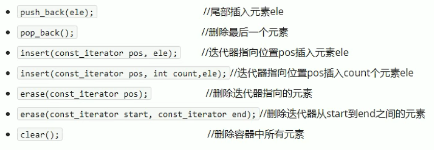

## 3.2 vector容器

### 3.2.1 vector基本概念

功能：

- vector数据结构和数组非常相似，也称为单端数组

vector与普通数组区别：

- 不同之处在于数组是静态空间，而vector可以动态扩展

动态扩展：

- 并不是在原空间之后续接新空间，而是找更大的内存空间，然后将原数据拷贝到新空间，释放原空间


- vector容器的迭代器是支持随机访问的迭代器

### 3.2.2 vector构造函数

函数原型：


**示例：**

```c++
#include<iostream>
using namespace std;
#include<vector>

void printVector(vector<int> &v)
{
	for (vector<int>::iterator it = v.begin(); it != v.end(); it++)
	{
		cout << (*it) << " ";
	}
	cout << endl;
}

void test01()
{
	vector<int>v1;	//默认构造 无参构造

	for (int i = 0; i < 10; i++)
	{
		v1.push_back(i);
	}

	printVector(v1);

	//通过区间方式进行构造
	vector<int>v2(v1.begin(), v1.end());
	printVector(v2);

	//n个elem方式构造
	vector<int>v3(10, 100);
	printVector(v3);

	//拷贝构造
	vector<int>v4(v3);
	printVector(v4);
}

int main(){
	
	test01();
	
	system("pause");
	
	return 0;
}
```

### 3.2.3 vector赋值操作

函数原型：

- vector& operator=(const vector &vec);    //重载等号操作符
- assign(beg,end);      //将（beg，end）区间中的数据拷贝赋值给本身
- assign(n,elem);        //将n个elem拷贝赋值给本身

**示例：**

```c++
#include<iostream>
using namespace std;
#include<vector>

void printVector1(vector<int>& v)
{
	for (vector<int>::iterator it = v.begin(); it != v.end(); it++)
	{
		cout << *it << " ";
	}
	cout << endl;
}

void test02()
{
	vector<int>v1;
	for (int i = 0; i < 10; i++)
	{
		v1.push_back(i);
	}
	printVector1(v1);

	//赋值 operator=
	vector<int>v2;
	v2 = v1;
	printVector1(v2);

	//assign
	vector<int>v3;
	v3.assign(v1.begin(), v1.end());
	printVector1(v3);

	//n个elem 方式赋值
	vector<int>v4;
	v4.assign(10, 100);
	printVector1(v4);
}

int main(){
	
	test02();
	
	system("pause");
	
	return 0;
}
```

### 3.2.4 vector容量和大小

函数原型：


**示例：**

```c++
#include<iostream>
using namespace std;
#include<vector>

void printVector2(vector<int>& v)
{
	for (vector<int>::iterator it = v.begin(); it != v.end(); it++)
	{
		cout << *it << " ";
	}
	cout << endl;
}

void test03()
{
	vector<int>v1;
	for (int i = 0; i < 10; i++)
	{
		v1.push_back(i);
	}
	printVector2(v1);

	if (v1.empty())		//为真 代表容器为空
	{
		cout << "v1为空" << endl;
	}
	else
	{
		cout << "v1不为空" << endl;
		cout << "v1的容量为：" << v1.capacity() << endl;
		cout << "v1的大小为：" << v1.size() << endl;
	}

	//重新指定大小
	v1.resize(15,100);		//如果重新指定的比原来长，默认用0填充新的位置,利用重载版本，可以指定默认填充值（100）
	printVector2(v1);	

	v1.resize(5);			//如果重新指定的比原来短了，超出部分会删除掉
	printVector2(v1);

}


int main(){
	
	test03();
	
	system("pause");
	
	return 0;
}
```

### 3.2.5 vector插入和删除

函数原型：



**示例：**

```c++
#include<iostream>
using namespace std;
#include<vector>

void printVector3(vector<int>& v)
{
	for (vector<int>::iterator it = v.begin(); it != v.end(); it++)
	{
		cout << *it << " ";
	}
	cout << endl;
}

void test04()
{
	vector<int>v1;

	//尾插
	v1.push_back(10);
	v1.push_back(20);
	v1.push_back(30);
	v1.push_back(40);
	v1.push_back(50);
	v1.push_back(60);
	printVector3(v1);

	//尾删
	v1.pop_back();
	printVector3(v1);

	//插入	第一个参数是迭代器
	v1.insert(v1.begin(), 100);
	printVector3(v1);

	v1.insert(v1.begin(), 2, 1000);
	printVector3(v1);

	//删除	参数也是迭代器
	v1.erase(v1.begin());
	printVector3(v1);

	//清空
	//v1.erase(v1.begin(), v1.end());
	v1.clear();
	printVector3(v1);
}

int main(){
	
	test04();
	
	system("pause");
	
	return 0;
}
```

### 3.2.6 vector数据存取

函数原型:


**示例：**

```c++
#include<iostream>
using namespace std;
#include<vector>

void test05()
{
	vector<int>v1;
	for (int i = 0; i < 10; i++)
	{
		v1.push_back(i);
	}

	//利用[]方式访问数组中的元素
	for (int i = 0; i < v1.size(); i++)
	{
		cout << v1[i] << " ";
	}
	cout << endl;

	//利用at方式访问元素
	for (int i = 0; i < v1.size(); i++)
	{
		cout << v1.at(i) << " ";
	}
	cout << endl;

	//获取第一个元素
	cout << "第一个元素为：" << v1.front() << endl;

	//获取最后一个元素
	cout << "最后一个元素为：" << v1.back() << endl;
}


int main(){

	test05();
	
	system("pause");
	
	return 0;
}
```

### 3.2.7 vector互换容器

实现两个容器内元素进行互换

函数原型：

- swap(vec);	//将vec与本身的元素互换

**示例：**

```c++
#include<iostream>
using namespace std;
#include<vector>

void printVector4(vector<int>& v)
{
	for (vector<int>::iterator it = v.begin(); it != v.end(); it++)
	{
		cout << *it << " ";
	}
	cout << endl;
}

//1、基本使用
void test06()
{
	vector<int>v1;

	cout << "交换前：" << endl;
	for (int i = 0; i < 10; i++)
	{
		v1.push_back(i);
	}
	printVector4(v1);

	vector<int>v2;
	
	for (int i = 10; i > 0; i--)
	{
		v2.push_back(i);
	}
	printVector4(v2);
	
	cout << "交换后：" << endl;
	v1.swap(v2);
	printVector4(v1);
	printVector4(v2);
}

//2、实际用途
//巧用swap可以收缩内存空间
void test06_1()
{
	vector<int>v;

	for (int i = 0; i < 100000; i++)
	{
		v.push_back(i);
	}
	cout << "v的容量为：" << v.capacity() << endl;
	cout << "v的大小为：" << v.size() << endl;

	v.resize(3);	//重新指定大小
	cout << "v的容量为：" << v.capacity() << endl;
	cout << "v的大小为：" << v.size() << endl;

	//巧用swap收缩内存
	vector<int>(v).swap(v);
	cout << "v的容量为：" << v.capacity() << endl;
	cout << "v的大小为：" << v.size() << endl;
}


int main(){
	
	test06();
	test06_1();
	
	system("pause");
	
	return 0;
}
```

### 3.2.8 vector预留空间

减少vector在动态扩展容量时的扩展次数

函数原型：

- reserve(int len);       //容器预留len个元素长度，预留位置不初始化，元素不可以访问

**示例：**

```c++
#include<iostream>
using namespace std;
#include<vector>

void test07()
{
	vector<int>v;

	//利用reserve预留空间
	v.reserve(100000);

	int num = 0;	//统计开辟次数
	int* p = NULL;
	for (int i = 0; i < 100000; i++)
	{
		v.push_back(i);
		if (p != &v[0])
		{
			p = &v[0];
			//cout << "第" << i << "次分配的内存空间大小：" << v.capacity() << endl;
			num++;
		}
	}
	cout << "num = " << num << endl;
}

int main(){
	
	test07();
	
	system("pause");
	
	return 0;
}
```

