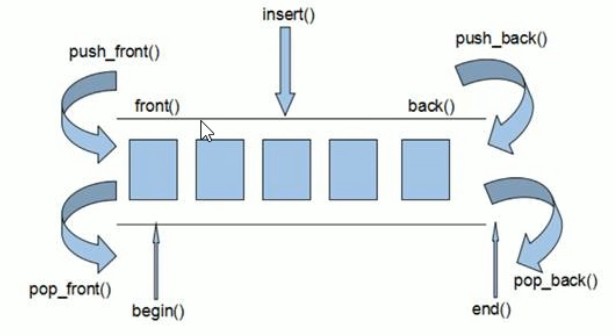
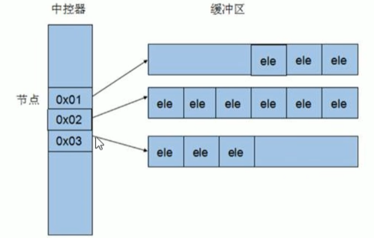
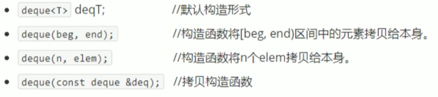
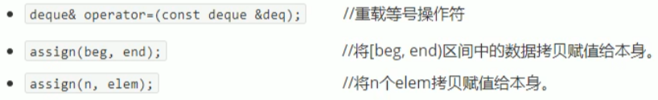
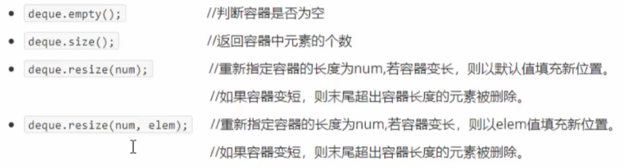
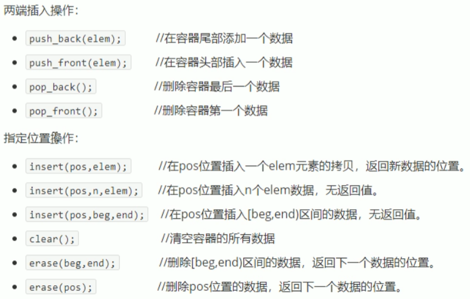
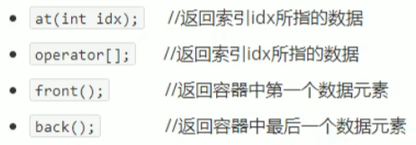

## 3.3 deque容器

### 3.3.1 deque容器基本概念

功能：

- 双端数组，可以对头端进行插入删除操作

deque与vector区别：

- vector对于头部的插入删除效率低，数据量越大，效率越低
- deque相对而言，对于头部的插入删除速度会比vector快
- vector访问元素时的速度会比deque快，这和两者内部实现有关



deque内部工作原理：

deque内部有个中控器，维护每段缓冲区中的内容，缓冲区中存放真实数据

中控器维护的是每个缓冲区的地址，使得使用deque时像一片连续的内部空间



- deque容器的迭代器也是支持随机访问的

### 3.3.2 deque 构造函数

函数原型：



**示例：**

```c++
#include<iostream>
using namespace std;
#include<deque>

void printDeque(const deque<int>& d)
{
	for (deque<int>::const_iterator it = d.begin(); it != d.end(); it++)
	{
		//*it = 100;	//const之后容器中的数据不可以修改了
		cout << *it << " ";
	}
	cout << endl;
}

void test01()
{
	deque<int>d1;
	for (int i = 0; i < 10; i++)
	{
		d1.push_back(i);
	}
	printDeque(d1);

	deque<int>d2(d1.begin(), d1.end());
	printDeque(d2);

	deque<int>d3(10, 100);
	printDeque(d3);

	deque<int>d4(d3);
	printDeque(d4);

}

int main(){
	
	test01();
	
	system("pause");
	
	return 0;
}
```

### 3.3.3 赋值操作

函数原型：



**示例：**

````c++
#include<iostream>
using namespace std;
#include<deque>

void printDeque2(const deque<int>& d)
{
	for (deque<int>::const_iterator it = d.begin(); it != d.end(); it++)
	{
		//*it = 100;	//const之后容器中的数据不可以修改了
		cout << *it << " ";
	}
	cout << endl;
}

void test02()
{
	deque<int>d1;

	for (int i = 0; i < 10; i++)
	{
		d1.push_back(i);
	}
	printDeque2(d1);

	//operator= 赋值
	deque<int>d2;
	d2 = d1;
	printDeque2(d2);

	//assign 赋值
	deque<int>d3;
	d3.assign(d1.begin(), d1.end());
	printDeque2(d3);

	//assign 赋值
	deque<int>d4;
	d4.assign(10, 100);
	printDeque2(d4);
}

int main(){
	
	test02();
	
	system("pause");
	
	return 0;
}
````

### 3.3.4 deque 大小操作

函数原型：



**示例：**

```c++
#include<iostream>
using namespace std;
#include<deque>

void printDeque3(const deque<int>& d)
{
	for (deque<int>::const_iterator it = d.begin(); it != d.end(); it++)
	{
		//*it = 100;	//const之后容器中的数据不可以修改了
		cout << *it << " ";
	}
	cout << endl;
}

void test03()
{
	deque<int>d1;

	for (int i = 0; i < 10; i++)
	{
		d1.push_back(i);
	}
	printDeque3(d1);

	if (d1.empty())
	{
		cout << "d1为空" << endl;
	}
	else
	{
		cout << "d1不为空" << endl;
		cout << "d1的大小为:" << d1.size() << endl;
		//deque容器没有容量概念
	}

	//重新指定大小
	//d1.resize(15);
	d1.resize(15,1);
	printDeque3(d1);

	d1.resize(5);
	printDeque3(d1);
}

int main(){
	
	test03();
	
	system("pause");
	
	return 0;
}
```

### 3.3.5 deque插入和删除

函数原型：



**示例：** 

```c++
#include<iostream>
using namespace std;
#include<deque>

void printDeque4(const deque<int>& d)
{
	for (deque<int>::const_iterator it = d.begin(); it != d.end(); it++)
	{
		//*it = 100;	//const之后容器中的数据不可以修改了
		cout << *it << " ";
	}
	cout << endl;
}

void test04()
{
	deque<int>d1;

	//尾插
	d1.push_back(10);
	d1.push_back(20);

	//头插
	d1.push_front(100);
	d1.push_front(200);

	printDeque4(d1);

	//尾删
	d1.pop_back();
	printDeque4(d1);

	//头删
	d1.pop_front();
	printDeque4(d1);
}

void test04_1()
{
	deque<int>d1;
	d1.push_back(10);
	d1.push_back(20);
	d1.push_back(100);
	d1.push_back(200);

	printDeque4(d1);

	//insert插入
	d1.insert(d1.begin(), 1000);
	printDeque4(d1);

	d1.insert(d1.begin(), 2, 10000);
	printDeque4(d1);

	//按照区间进行插入
	deque<int>d2;
	d2.push_back(1);
	d2.push_back(2);
	d2.push_back(3);
	d2.push_back(4);

	d1.insert(d1.begin(), d2.begin(), d2.end());
	printDeque4(d1);
}
void test04_2()
{
	deque<int>d1;
	d1.push_back(10);
	d1.push_back(20);
	d1.push_back(100);
	d1.push_back(200);

	//删除
	deque<int>::iterator it = d1.begin();
	it++;
	d1.erase(it);
	printDeque4(d1);

	//按区间方式删除
	//d1.erase(d1.begin(), d1.end());
	//清空
	d1.clear();
	printDeque4(d1);
}

int main(){
	
	test04();
	test04_1();
	test04_2();
	
	system("pause");
	
	return 0;
}
```

### 3.3.6 deque 数据存取

函数原型：



**示例：**

```c++
#include<iostream>
using namespace std;
#include<deque>

void test05()
{
	deque<int>d1;
	d1.push_back(10);
	d1.push_back(20);
	d1.push_back(30);
	d1.push_front(100);
	d1.push_front(200);
	d1.push_front(300);

	//通过[]方式访问元素
	for (int i = 0; i < d1.size(); i++)
	{
		cout << d1[i] << " ";
	}
	cout << endl;

	//通过at方式访问元素
	for (int i = 0; i < d1.size(); i++)
	{
		cout << d1.at(i) << " ";
	}
	cout << endl;

	cout << "第一个元素为：" << d1.front() << endl;
	cout << "最后一个元素为：" << d1.back() << endl;
}

int main(){
	
	test05();
	
	system("pause");
	
	return 0;
}
```

### 3.3.7 deque排序

算法:

- sort(iterator beg,iterator end);       // 对beg和end区间内元素进行排序

**示例：**

```c++
#include<iostream>
using namespace std;
#include<deque>
#include<algorithm>		//标准算法头文件

void printDeque5(const deque<int>& d)
{
	for (deque<int>::const_iterator it = d.begin(); it != d.end(); it++)
	{
		cout << *it << " ";
	}
	cout << endl;
}

void test06()
{
	deque<int>d1;
	d1.push_back(10);
	d1.push_back(20);
	d1.push_back(30);
	d1.push_front(100);
	d1.push_front(200);
	d1.push_front(300);

	printDeque5(d1);

	//排序 默认排序规则 从小到大 升序
	//对于支持随机访问的迭代器的容器，都可以利用sort算法直接对其进行排序
	sort(d1.begin(), d1.end());
	printDeque5(d1);

}

int main(){
	
	test06();
	
	system("pause");
	
	return 0;
}
```


