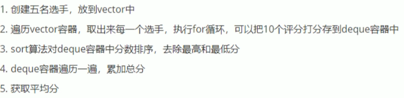

## 3.4 案例-评委打分

### 3.4.1 案例描述

有5名选手：选手ABCDE,10个评委分别对每一个选手打分，去除最高分，去除评委中最低分，去平均分。


### 3.4.2 实现步骤



**示例：**

```c++
#include<iostream>
using namespace std;
#include<vector>
#include<deque>
#include<algorithm>
#include<ctime>

class Person
{
public:
	Person(string name,int score)
	{
		this->name = name;
		this->score = score;
	}

	string name;	//姓名
	int score;		//平均分	
};

void creatPerson(vector<Person>& v)
{
	string nameSeed = "ABCDE";
	for (int i = 0; i < 5; i++)
	{
		string name = "选手";
		name += nameSeed[i];
		
		int score = 0;
		Person p(name, score);

		//将创建的person对象，放入到容器中
		v.push_back(p);
	}
}

//打分
void setScore(vector<Person>& v)
{
	for (vector<Person>::iterator it = v.begin(); it != v.end(); it++)
	{
		//将评委的分数 放入到deque容器中
		deque<int>d;
		for (int i = 0; i < 10; i++)
		{
			int score = rand() % 41 + 60;// 随机数60~100
			d.push_back(score);
		}

		/*cout << "选手：" << it->name << " 打分：" << endl;
		for (deque<int>::iterator dit = d.begin(); dit != d.end(); dit++)
		{
			cout << *dit << " ";
		}
		cout << endl;*/

		//排序
		sort(d.begin(), d.end());

		//去除最高分和最低分
		d.pop_back();
		d.pop_front();

		//取平均分
		int sum = 0;
		for (deque<int>::iterator dit = d.begin(); dit != d.end(); dit++)
		{
			sum += *dit;	//累加每个评委的分数
		}
		int avg = sum / d.size();

		//将平均分 赋值给选手
		//it->score = avg;
		(*it).score = avg;
	}
}

void showScore(vector<Person>& v)
{
	for (vector<Person>::iterator it = v.begin(); it != v.end(); it++)
	{
		cout << "姓名：" << it->name << " 平均分：" << it->score << endl;
	}
}


int main(){
	
	//随机数种子
	srand((unsigned int)time(NULL));

	//1、创建5名选手
	vector<Person>v;	//存放选手容器
	creatPerson(v);
	
	//测试
	/*for (vector<Person>::iterator it = v.begin(); it != v.end(); it++)
	{
		cout << "姓名：" << (*it).name << " 分数：" << (*it).score << endl;
	}*/

	//2、给5名选手打分
	setScore(v);
    
	//3、显示最后得分
	showScore(v);
	
	system("pause");
	
	return 0;
}
```

