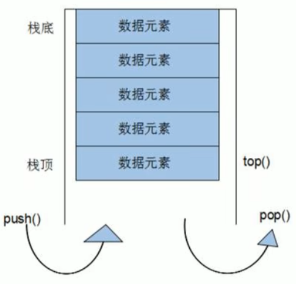
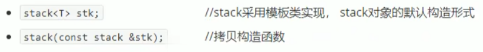
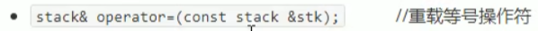
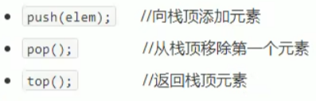
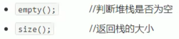

## 3.5 stack容器

### 3.5.1 stack基本概念

概念：stack是一种先进后出（First In Last Out,FILO）的数据结构，它只有一个出口



栈中只有的顶端的元素才可以被外界使用，因此栈不允许有遍历行为

栈中进入数据称为 --- 入栈push

栈中弹出数据称为 --- 出栈pop

### 3.5.2 stack 常用接口

构造函数：

.

赋值操作：

.

数据存取：

.

大小操作：

.

**示例：**

```c++
#include<iostream>
using namespace std;
#include<stack>

//栈stack容器

void test01()
{
	stack<int>s;

	//入栈
	s.push(10);
	s.push(20);
	s.push(30);
	s.push(40);
	s.push(50);

	cout << "栈的大小：" << s.size() << endl;

	//只要栈不为空，查看栈顶，并执行出栈操作
	while (!s.empty())
	{
		//查看栈顶元素
		cout << "栈顶元素为：" << s.top() << endl;

		//出栈
		s.pop();
	}

	cout << "栈的大小：" << s.size() << endl;
}

int main(){
	
	test01();
	
	system("pause");
	
	return 0;
}
```

