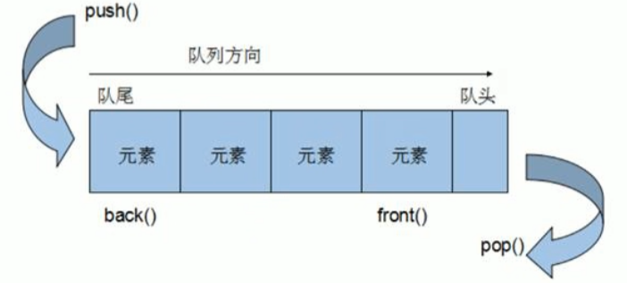
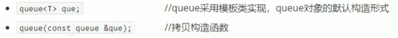
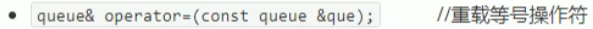
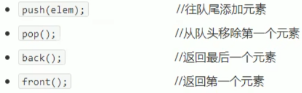
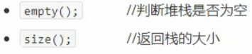

## 3.6 queue 容器

### 3.6.1 基本概念

概念：Queue是一种先进先出（First In First Out,FIFO）的数据结构，它有两个出口



队列容器运行从一端新增元素，从另一端移除元素

队列中只有对头和队尾才可以被外界使用，因此队列不允许有遍历行为

队列中进数据称为 --- 入队 push

队列中出数据称为 --- 出队 pop

### 3.6.2 queue 常用接口

构造函数：



赋值操作：

.

数据存取：

.

大小操作：

.

**示例：**

```c++
#include<iostream>
using namespace std;
#include<queue>

//队列Queue
class Person
{
public:
	Person(string name, int age)
	{
		this->name = name;
		this->age = age;
	}

	string name;
	int age;
};

void test01()
{
	//创建队列
	queue<Person>q;

	//准备数据
	Person p1("唐僧", 30);
	Person p2("孙悟空", 1000);
	Person p3("猪八戒", 900);
	Person p4("沙和尚", 700);

	q.push(p1);
	q.push(p2);
	q.push(p3);
	q.push(p4);

	cout << "队列大小为：" << q.size() << endl;

	//判断只要队列不为空，查看队头，查看队尾，出队
	while (!q.empty())
	{
		cout << "--------" << endl;
		//查看队头
		cout << "队头元素 -- 姓名：" << q.front().name << " 年龄：" << q.front().age << endl;

		//查看队尾
		cout << "队尾元素 -- 姓名：" << q.back().name << " 年龄：" << q.back().age << endl;

		//出队
		q.pop();
	}

	cout << "队列大小为：" << q.size() << endl;
}


int main(){
	
	test01();
	
	system("pause");
	
	return 0;
}
```

