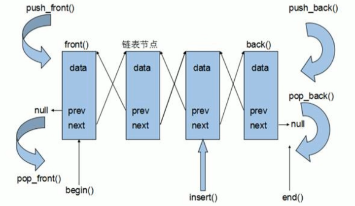
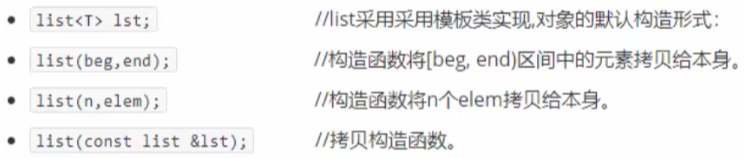
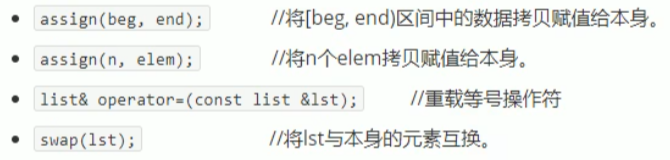
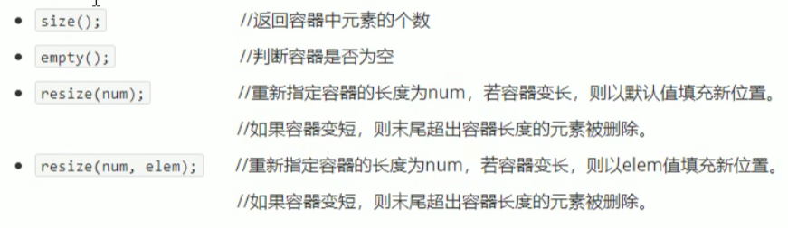
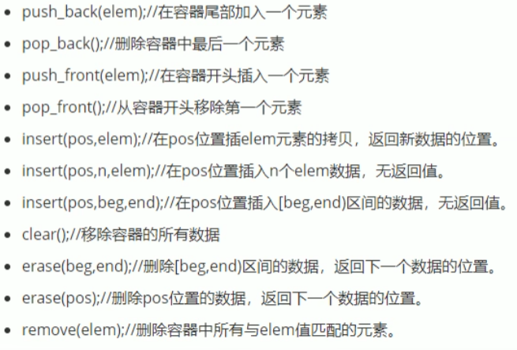
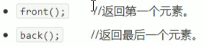
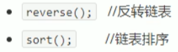

## 3.7 list容器

### 3.7.1 list基本概念

功能：将数据进行链式存储

链表（list）是一种物理存储单元上非连续的存储结构，数据元素的逻辑顺序是通过链表中的指针链接实现的

链表的组成：链表由一系列结点组成

结点的组成：一个是存储数据元素的数据域，另一个是存储下一个结点地址的指针域

STL中的链表是一个双向循环链表



由于链表的存储方式不是连续的内存空间，因此链表list中的迭代器只支持前移和后移，属于双向迭代器

list的优点：

- 采用动态存储分配，不会造成内存浪费和溢出
- 链表执行插入和删除操作十分方便，修改指针即可，不需要移动大量元素

list的缺点：

- 链表灵活，但是空间（指针域）和 时间（遍历）额外耗费较大

List有一个重要的性质，插入操作和删除操作都不会造成原有list迭代器的失效，这在vector是不成立的

STL中List和vector是两个最常被使用的容器

### 3.7.2 list构造函数

函数原型：

.

**示例：**

```c++
#include<iostream>
using namespace std;
#include<list>

void printList(const list<int>& L)
{
	for (list<int>::const_iterator it = L.begin(); it != L.end(); it++)
	{
		cout << *it << " ";
	}
	cout << endl;
}

void test01()
{
	list<int> L1;	//默认构造

	//添加数据
	L1.push_back(10);
	L1.push_back(20);
	L1.push_back(30);
	L1.push_back(40);
	L1.push_back(50);

	printList(L1);

	//区间方式构造
	list<int>L2(L1.begin(), L1.end());
	printList(L2);

	//拷贝构造
	list<int>L3(L2);
	printList(L3);

	//n个elem
	list<int>L4(10, 1000);
	printList(L4);
}

int main(){
	
	test01();
	
	system("pause");
	
	return 0;
}
```

### 3.7.3  list赋值和交换

函数原型：

.

```c++
#include<iostream>
using namespace std;
#include<list>

void printList2(const list<int>& L)
{
	for (list<int>::const_iterator it = L.begin(); it != L.end(); it++)
	{
		cout << *it << " ";
	}
	cout << endl;
}

void test02()
{
	list<int>L1;

	L1.push_back(10);
	L1.push_back(20);
	L1.push_back(30);
	L1.push_back(40);

	printList2(L1);

	
	list<int>L2;
	L2 = L1;	//operator=方式赋值
	printList2(L2);	

	list<int>L3;
	L3.assign(L2.begin(), L2.end());	//assign赋值
	printList2(L3);

	list<int>L4;
	L4.assign(10, 100);
	printList2(L4);
}

void test02_1()
{
	list<int>L1;

	L1.push_back(10);
	L1.push_back(20);
	L1.push_back(30);
	L1.push_back(40);

	list<int>L2;
	L2.assign(10, 100);

	cout << "交换前：" << endl;
	printList2(L1);
	printList2(L2);

	L1.swap(L2);

	cout << "交换后：" << endl;
	printList2(L1);
	printList2(L2);

}

int main(){
	
	test02();
	test02_1();

	system("pause");
	
	return 0;
}
```

### 3.7.4 list大小操作

函数原型：

.

```c++
#include<iostream>
using namespace std;
#include<list>

void printList3(const list<int>& L)
{
	for (list<int>::const_iterator it = L.begin(); it != L.end(); it++)
	{
		cout << *it << " ";
	}
	cout << endl;
}

void test03()
{
	list<int>L1;
	L1.push_back(10);
	L1.push_back(20);
	L1.push_back(30);
	L1.push_back(40);
	printList3(L1);

	//判断容器是否为空
	if (L1.empty())
	{
		cout << "L1为空" << endl;
	}
	else
	{
		cout << "L1不为空" << endl;
		cout << "L1的元素个数为：" << L1.size() << endl;
	}

	//重新指定大小
	L1.resize(10);
	printList3(L1);

	L1.resize(5);
	printList3(L1);

}

int main(){
	
	test03();

	system("pause");
	
	return 0;
}
```

### 3.7.5 list插入和删除

函数原型：

.

```c++
#include<iostream>
using namespace std;
#include<list>

void printList4(const list<int>& L)
{
	for (list<int>::const_iterator it = L.begin(); it != L.end(); it++)
	{
		cout << *it << " ";
	}
	cout << endl;
}


void test04()
{
	list<int>L1;

	//尾插
	L1.push_back(10);
	L1.push_back(20);
	L1.push_back(30);

	//头插
	L1.push_front(100);
	L1.push_front(200);
	L1.push_front(300);

	printList4(L1);

	//尾删
	L1.pop_back();
	printList4(L1);

	//头删
	L1.pop_front();
	printList4(L1);

	//insert插入
	list<int>::iterator it = L1.begin();
	L1.insert(++it, 1000);
	printList4(L1);

	//删除
	it = L1.begin();
	L1.erase(it);
	printList4(L1);

	//remove移除
	L1.push_back(10000);
	L1.push_back(10000);
	L1.push_back(10000);
	printList4(L1);
	L1.remove(10000);
	printList4(L1);

	//清空
	L1.clear();
	printList4(L1);
}

int main(){
	
	test04();
	
	system("pause");
	
	return 0;
}
```

### 3.7.6 list数据存取

函数原型：

.

```c++
#include<iostream>
using namespace std;
#include<list>

void printList5(const list<int>& L)
{
	for (list<int>::const_iterator it = L.begin(); it != L.end(); it++)
	{
		cout << *it << " ";
	}
	cout << endl;
}

void test05()
{

	list<int>L1;

	L1.push_back(10);
	L1.push_back(20);
	L1.push_back(30);

	//L1[0]	不可以用[]访问list容器中的元素
	//L1.at()	不可以用at方式访问list容器中的元素
	//原因是list本质链表，不是用连续线性空间存储数据，迭代器也是不支持随机访问的
	cout << "第一个元素为：" << L1.front() << endl;
	cout << "最后一个元素为：" << L1.back() << endl;

	//验证迭代器是不支持随机访问的
	list<int>::iterator it = L1.begin();
	it++;	//支持双向
	it--;
	//it = it + 1;	//不支持随机访问
}

int main(){
	
	test05();
	
	system("pause");
	
	return 0;
}
```

### 3.7.7 list反转和排序

函数原型:

.

```c++
#include<iostream>
using namespace std;
#include<list>
#include<algorithm>

void printList6(const list<int>& L)
{
	for (list<int>::const_iterator it = L.begin(); it != L.end(); it++)
	{
		cout << *it << " ";
	}
	cout << endl;
}

void test06()
{
	list<int>L1;

	L1.push_back(10);
	L1.push_back(20);
	L1.push_back(30);
	L1.push_back(40);

	cout << "反转前:" << endl;
	printList6(L1);

	//反转
	cout << "反转后:" << endl;
	L1.reverse();
	printList6(L1);
}

bool myCompare(int v1,int v2)
{
	//降序 让第一个数 > 第二个数
	return v1 > v2;
}

void test06_1()
{
	list<int>L1;

	L1.push_back(30);
	L1.push_back(40);
	L1.push_back(10);
	L1.push_back(20);
	
	//排序
	cout << "排序前:" << endl;
	printList6(L1);

	//所有不支持随机访问迭代器的容器,不可以使用标准算法
	//不支持随机访问迭代器的容器,内部会提供对应一些算法
	cout << "排序后:" << endl;
	L1.sort();		//默认排序规则 从小到大,升序
	printList6(L1);

	L1.sort(myCompare);
	printList6(L1);
	
}

int main(){
	
	test06();
	test06_1();
	
	system("pause");
	
	return 0;
}
```

### 3.7.8 排序案例

案例描述:将Person自定义数据类型进行排序,Person中属性有姓名,年龄,身高

排序规则:按照年龄进行升序,如果年龄相同按照身高进行降序

```c++
#include<iostream>
using namespace std;
#include<list>

class Person
{
public:
	Person(string name, int age, int height)
	{
		this->name = name;
		this->age = age;
		this->height = height;
	}

	string name;
	int age;
	int height;
};

void printListPerson(const list<Person>& L)
{
	for (list<Person>::const_iterator it = L.begin(); it != L.end(); it++)
	{
		cout << "姓名:" << (*it).name << " 年龄:" << it->age << " 身高:" << it->height << endl;
	}
}

//指定排序规则
bool comparePerson(Person& p1, Person& p2)
{
	//按照年龄 升序
	if (p1.age == p2.age)
	{
		//年龄相同 按身高降序
		return p1.height > p2.height;
	}
	else
	{
		return p1.age < p2.age;
	}
}

void test07()
{
	list<Person>L;	//创建容器

	//准备数据
	Person p1("刘备", 35, 175);
	Person p2("曹操", 45, 180);
	Person p3("孙权", 40, 170);
	Person p4("赵云", 25, 190);
	Person p5("张飞", 35, 185);
	Person p6("关羽", 35, 200);

	//插入数据
	L.push_back(p1);
	L.push_back(p2);
	L.push_back(p3);
	L.push_back(p4);
	L.push_back(p5);
	L.push_back(p6);

	printListPerson(L);

	//排序
	cout << "排序后" << endl;
	L.sort(comparePerson);
	printListPerson(L);

}

int main(){
	
	test07();
	
	system("pause");
	
	return 0;
}
```

