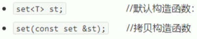
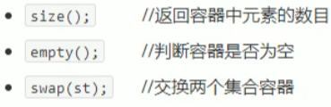
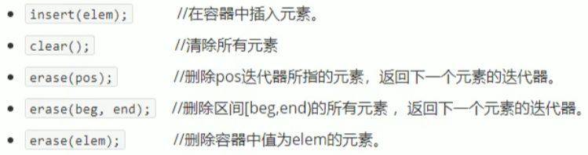
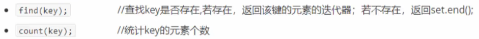
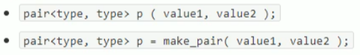

## 3.8 set/ multiset 容器

### 3.8.1 set基本概念

- 所有元素都会在插入时自动被排序

本质

- set/ multiset 属于关联式容器,底层结构是用二叉树实现

set 和 multiset 区别:

- set不允许容器中有重复的元素
- multiset允许容器中有重复的元素

### 3.8.2 set构造和赋值

构造:

.

赋值:

.

```c++
#include<iostream>
using namespace std;
#include<set>

void printSet(set<int>& st)
{
	for (set<int>::iterator it = st.begin(); it != st.end(); it++)
	{
		cout << *it << " ";
	}
	cout << endl;
}

void test01()
{
	set<int>st1;

	//插入数据 只有insert方式
	st1.insert(10);
	st1.insert(40);
	st1.insert(30);
	st1.insert(20);
	st1.insert(30);

	//set容器特点:所有元素插入时自动排序
	//set容器不允许插入重复值
	printSet(st1);
	
	//拷贝构造
	set<int>st2(st1);
	printSet(st2);

	//赋值
	set<int>st3;
	st3 = st2;
	printSet(st3);
}

int main(){
	
	test01();
	
	system("pause");
	
	return 0;
}
```

### 3.8.3 set大小和交换

函数原型:

.

```c++
#include<iostream>
using namespace std;
#include<set>

void printSet2(set<int>& st)
{
	for (set<int>::iterator it = st.begin(); it != st.end(); it++)
	{
		cout << *it << " ";
	}
	cout << endl;
}

//大小
void test02()
{
	set<int>s1;

	s1.insert(10);
	s1.insert(20);
	s1.insert(40);
	s1.insert(30);

	printSet2(s1);

	//判断是否为空
	if (s1.empty())
	{
		cout << "s1为空" << endl;
	}
	else
	{
		cout << "s1不为空" << endl;
		cout << "s1的大小为:" << s1.size() << endl;
	}
}

//交换
void test02_1()
{
	set<int>s1;

	s1.insert(10);
	s1.insert(20);
	s1.insert(40);
	s1.insert(30);

	set<int>s2;

	s2.insert(100);
	s2.insert(200);
	s2.insert(400);
	s2.insert(300);

	cout << "交换前:" << endl;
	printSet2(s1);
	printSet2(s2);

	cout << "交换后:" << endl;
	s1.swap(s2);
	printSet2(s1);
	printSet2(s2);
}


int main(){
	
	test02();
	test02_1();
	
	system("pause");
	
	return 0;
}
```

### 3.8.4 set插入和删除

函数原型:

.

```c++
#include<iostream>
using namespace std;
#include<set>

void printSet3(set<int>& st)
{
	for (set<int>::iterator it = st.begin(); it != st.end(); it++)
	{
		cout << *it << " ";
	}
	cout << endl;
}

void test03()
{
	set<int>s1;

	s1.insert(10);
	s1.insert(20);
	s1.insert(50);
	s1.insert(30);
	s1.insert(40);

	printSet3(s1);

	//删除
	s1.erase(s1.begin());
	printSet3(s1);

	//删除重载版本
	s1.erase(30);
	printSet3(s1);

	//清空
	//s1.erase(s1.begin(), s1.end());
	s1.clear();
	printSet3(s1);
}

int main(){
	
	test03();

	system("pause");
	
	return 0;
}
```

### 3.8.5 set查找和统计

函数原型:



```c++
#include<iostream>
using namespace std;
#include<set>

void test04()
{
	set<int>s1;

	s1.insert(10);
	s1.insert(20);
	s1.insert(30);
	s1.insert(40);

	set<int>::iterator pos = s1.find(30);
	if (pos != s1.end())
	{
		cout << "找到元素:" << *pos << endl;
	}
	else
	{
		cout << "未找到元素:" << *pos << endl;
	}
}

void test04_1()
{
	set<int>s1;

	s1.insert(10);
	s1.insert(20);
	s1.insert(30);
	s1.insert(40);

	//统计30的个数
	int num1 = s1.count(30);
	//对于set而言 统计结果 要么是0 要么是1
	cout << "num = " << num1 << endl;	

	int num2 = s1.count(300);
	cout << "num = " << num2 << endl;
}

int main(){
	
	test04();
	test04_1();
	
	system("pause");
	
	return 0;
}
```

### 3.8.6  set和multiset区别

- 掌握set和multiset的区别

区别:

- set不可以插入重复数据,而multiset可以
- set插入数据的同时会返回结果,表示插入成功
- multiset不会检测数据,因此可以插入重复数据

```c++
#include<iostream>
using namespace std;
#include<set>

void test05()
{
	set<int>s;

	pair<set<int>::iterator, bool>ret = s.insert(10);

	if (ret.second)
	{
		cout << "第一次插入成功" << endl;
	}
	else 
	{
		cout << "第一次插入失败" << endl;
	}

	ret = s.insert(10);
	if (ret.second)
	{
		cout << "第二次插入成功" << endl;
	}
	else
	{
		cout << "第二次插入失败" << endl;
	}

	multiset<int>ms;

	//multiset允许插入重复值
	ms.insert(10);
	ms.insert(10);
	ms.insert(10);
	ms.insert(10);

	for (multiset<int>::iterator it = ms.begin(); it != ms.end(); it++)
	{
		cout << *it << " ";
	}
	cout << endl;
}

int main(){
	
	test05();
	
	system("pause");
	
	return 0;
}
```

### 3.8.7 pair对组创建

- 成对出现的数据,利用对组可以返回两个数据

函数原型:

.

```c++
#include<iostream>
using namespace std;

void test06()
{
	//第一种方式创建对组
	pair<string, int>p("Tom", 20);

	cout << "姓名:" << p.first << " 年龄:" << p.second << endl;

	//第二种方式创建对组
	pair<string, int>p2 = make_pair("Jerry", 18);
	cout << "姓名:" << p2.first << " 年龄:" << p2.second << endl;
}

int main(){
	
	test06();
	
	system("pause");
	
	return 0;
}
```

### 3.8.8 set容器排序

- set容器默认排序规则为从小到大,掌握如何改变排序规则

主要技术点:

- 利用仿函数,可以改变排序规则

**示例一**  set存放内置数据类型

```c++
#include<iostream>
using namespace std;
#include<set>

class MyCompare
{
public:
	bool operator()(int v1,int v2) const
	{
		return v1 > v2;
	}
};

void test07()
{
	set<int>s1;

	s1.insert(10);
	s1.insert(20);
	s1.insert(30);
	s1.insert(40);

	for (set<int>::iterator it = s1.begin(); it != s1.end(); it++)
	{
		cout << *it << " ";
	}
	cout << endl;

	//指定排序规则为从大到小
	set<int, MyCompare>s2;

	s2.insert(10);
	s2.insert(20);
	s2.insert(30);
	s2.insert(40);

	for (set<int, MyCompare>::iterator it = s2.begin(); it != s2.end(); it++)
	{
		cout << *it << " ";
	}
	cout << endl;
}

int main(){
	
	test07();
	
	system("pause");
	
	return 0;
}
```

**示例二**  set存放自定义数据类型

```c++
#include<iostream>
using namespace std;
#include<set>

class Person
{
public:
	Person(string name, int age)
	{
		this->name = name;
		this->age = age;
	}

	string name;
	int age;
};

class comparePerson
{
public:
	bool operator()(const Person& p1, const Person& p2)const
	{
		//按照年龄 降序
		return p1.age > p2.age;
	}
};

void test08()
{
	//自定义数据类型 都要指定顺序规则
	set<Person, comparePerson>s;

	Person p1("刘备", 24);
	Person p2("关羽", 28);
	Person p3("张飞", 26);
	Person p4("赵云", 21);

	s.insert(p1);
	s.insert(p2);
	s.insert(p3);
	s.insert(p4);


	for (set<Person, comparePerson>::iterator it = s.begin(); it != s.end(); it++)
	{
		cout << "姓名:" << it->name << " 年龄:" << it->age << endl;
	}
	cout << endl;
}

int main(){
	
	test08();

	system("pause");
	
	return 0;
}
```

