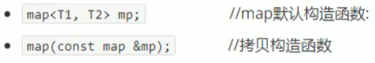
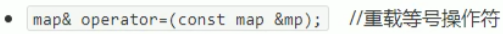
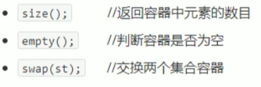
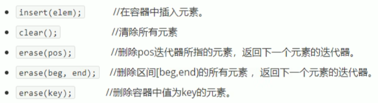
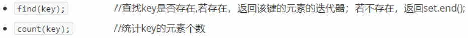

## 3.9 map multimap容器

### 3.9.1 map基本概念

- map中所有元素都是pair
- pair中第一个元素为key(键值),起到索引作用,第二个元素为value(实值)
- 所有元素都会根据元素的键值自动排序

本质:

- map multimap属于关联式容器,底层结构是用二叉树实现

优点:

- 可以根据key值快速找到value值

map和multimap区别:

- map不允许容器中有重复key值元素
- multimap允许容器中有重复key值元素

### 3.9.2 map构造和赋值

函数原型:

构造:

.

赋值:

.

```c++
#include<iostream>
using namespace std;
#include<map>

void printMap(map<int, int>& m)
{
	for (map<int, int>::iterator it = m.begin(); it != m.end(); it++)
	{
		cout << "key = " << (*it).first << " value = " << (*it).second << endl;
	}
	cout << endl;
}

void test01()
{
	map<int, int>m;

	m.insert(pair<int, int>(1, 10));
	m.insert(pair<int, int>(3, 30));
	m.insert(pair<int, int>(2, 20));	
	m.insert(pair<int, int>(4, 40));

	printMap(m);

	//拷贝构造
	map<int, int>m2(m);
	printMap(m2);

	//赋值
	map<int, int>m3;
	m3 = m2;
	printMap(m3);
}

int main(){
	
	test01();
	
	system("pause");
	
	return 0;
}
```

### 3.9.3 map大小和交换

函数原型:

.

```c++
#include<iostream>
using namespace std;
#include<map>

void printMap2(map<int, int>& m)
{
	for (map<int, int>::iterator it = m.begin(); it != m.end(); it++)
	{
		cout << "key = " << (*it).first << " value = " << (*it).second << endl;
	}
	cout << endl;
}

//大小
void test02()
{
	map<int, int>m;

	m.insert(pair<int, int>(1, 10));
	m.insert(pair<int, int>(2, 20));
	m.insert(pair<int, int>(3, 30));

	if (m.empty())
	{
		cout << "m为空" << endl;
	}
	else
	{
		cout << "m不为空" << endl;
		cout << "m的大小为:" << m.size() << endl;
	}
}

//交换
void test02_1()
{
	map<int, int>m1;
	m1.insert(pair<int, int>(1, 10));
	m1.insert(pair<int, int>(2, 20));
	m1.insert(pair<int, int>(3, 30));

	map<int, int>m2;
	m2.insert(pair<int, int>(4, 100));
	m2.insert(pair<int, int>(5, 200));
	m2.insert(pair<int, int>(6, 300));

	cout << "交换前" << endl;
	printMap2(m1);
	printMap2(m2);

	cout << "交换后" << endl;
	m1.swap(m2);
	printMap2(m1);
	printMap2(m2);
}

int main(){
	
	test02();
	test02_1();

	system("pause");
	
	return 0;
}
```

### 3.9.4 map插入和删除

函数原型:



```c++
#include<iostream>
using namespace std;
#include<map>

void printMap3(map<int, int>& m)
{
	for (map<int, int>::iterator it = m.begin(); it != m.end(); it++)
	{
		cout << "key = " << (*it).first << " value = " << (*it).second << endl;
	}
	cout << endl;
}

void test03()
{
	map<int, int>m;

	//插入
	//第一种
	m.insert(pair<int, int>(1, 10));
	m.insert(pair<int, int>(2, 20));
	m.insert(pair<int, int>(3, 30));

	//第二种
	m.insert(make_pair(4,40));

	//第三种
	m.insert(map<int, int>::value_type(5, 50));

	//第四种
	m[6] = 60;

	//[]不建议插入,用途 可以利用key访问value
	cout << m[6] << endl;

	printMap3(m);

	//删除
	m.erase(m.begin());
	printMap3(m);

	m.erase(3);	//按照key删除
	printMap3(m);

	//清空
	//m.erase(m.begin(),m.end());
	m.clear();
	printMap3(m);

}

int main(){
	
	test03();
	
	system("pause");
	
	return 0;
}
```

### 3.9.5 查找和统计

函数原型:



```c++
#include<iostream>
using namespace std;
#include<map>

void test04()
{
	map<int, int>m;
	m.insert(make_pair(1, 10));
	m.insert(make_pair(2, 20));
	m.insert(make_pair(3, 30));
	m.insert(make_pair(3, 40));

	//查找
	map<int, int>::iterator pos = m.find(3);

	if (pos != m.end())
	{
		cout << "查到了元素 key = " << (*pos).first << " value = " << pos->second << endl;
	}
	else
	{
		cout << "未找到元素" << endl;
	}

	//统计
	//map不允许插入重复key 元素,count 统计而言 结果要么是0 要么是1
	//multimap的count统计可能大于1
	int num = m.count(3);
	cout << "num = " << num << endl;

}

int main(){
	
	test04();
	
	system("pause");
	
	return 0;
}
```

### 3.9.6 map容器排序

- map容器默认排序规则为 按照key值进行从小到大排序,掌握如何改变排序规则

主要技术点:

- 利用仿函数,可以改变排序规则

```c++
#include<iostream>
using namespace std;
#include<map>

class MyCompare
{
public:
	bool operator()(int v1, int v2) const
	{
		//降序
		return v1 > v2;
	}
};

void printMap4(map<int, int, MyCompare>& m)
{
	for (map<int, int, MyCompare>::iterator it = m.begin(); it != m.end(); it++)
	{
		cout << "key = " << (*it).first << " value = " << (*it).second << endl;
	}
	cout << endl;
}

void test05()
{
	map<int, int, MyCompare>m1;

	m1.insert(make_pair(1, 10));
	m1.insert(make_pair(2, 20));
	m1.insert(make_pair(3, 30));
	m1.insert(make_pair(4, 40));
	m1.insert(make_pair(5, 50));

	printMap4(m1);
}

int main(){
	
	test05();
	
	system("pause");
	
	return 0;
}
```

