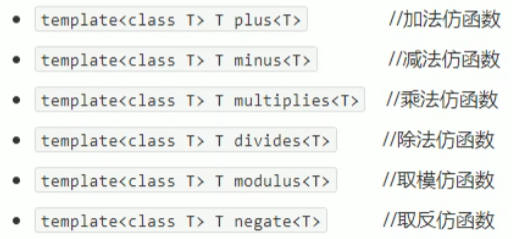
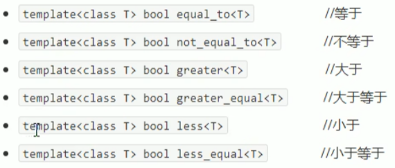
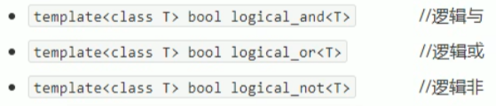

## 4.3 内建函数对象

### 4.3.1 内建函数对象意义

概念:

- STL内建了一些函数对象

分类:

- 算术仿函数
- 关系仿函数
- 逻辑仿函数

用法:

- 这些仿函数所产生的对象,用法和一般函数完全相同
- 使用内建函数对象,需要引入头文件#include<functional>

### 4.3.2 算术仿函数

- 实现四则运算
- 其中negate是一元运算,其他都是二元运算

仿函数原型:

.

**示例:**

```c++
#include<iostream>
using namespace std;
#include<functional>


//nagate 一元仿函数 取反仿函数
void test04()
{
	negate<int>n;

	cout << n(50) << endl;
}

//plus 二元仿函数 加法
void test04_1()
{
	plus<int>p;

	cout << p(10, 20) << endl;
}


int main(){

	test04();
	test04_1();
	
	system("pause");
	
	return 0;
}
```

### 4.3.3 关系仿函数

仿函数原型：

.

**示例:**

```c++
#include<iostream>
using namespace std;
#include<vector>
#include<algorithm>
#include<functional>

class MyCompare
{
public:
	bool operator()(int v1,int v2)
	{
		return v1 > v2;
	}
};

void test05()
{
	vector<int>v;

	v.push_back(10);
	v.push_back(30);
	v.push_back(40);
	v.push_back(20);
	v.push_back(50);

	for (vector<int>::iterator it = v.begin(); it != v.end(); it++)
	{
		cout << *it << " ";
	}
	cout << endl;

	//降序
	//sort(v.begin(), v.end(), MyCompare());
	//greater<int>() 内建函数对象
	sort(v.begin(), v.end(), greater<int>());
	for (vector<int>::iterator it = v.begin(); it != v.end(); it++)
	{
		cout << *it << " ";
	}
	cout << endl;
}

int main(){
	
	test05();
	
	system("pause");
	
	return 0;
}
```

### 4.3.4 逻辑仿函数

函数原型：

.

**示例：**

```c++
#include<iostream>
using namespace std;
#include<vector>
#include<algorithm>
#include<functional>

void test06()
{
	vector<bool>v;
	v.push_back(true);
	v.push_back(false);
	v.push_back(true);
	v.push_back(false);

	for (vector<bool>::iterator it = v.begin(); it != v.end(); it++)
	{
		cout << *it << " ";
	}
	cout << endl;

	//利用逻辑非 将容器v 搬运到 容器v2中,并执行取反操作
	vector<bool>v2;
	v2.resize(v.size());

	transform(v.begin(), v.end(), v2.begin(), logical_not<bool>());
	for (vector<bool>::iterator it = v2.begin(); it != v2.end(); it++)
	{
		cout << *it << " ";
	}
	cout << endl;
}

int main(){
	
	test06();
	
	system("pause");
	
	return 0;
}
```

