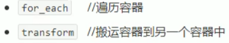
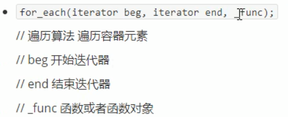
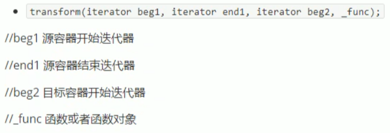

# 5 STL常用算法

概述

- 算法主要是由头文件<algorithm><functional><numeric>组成。
- <algorithm>是所有STL头文件中最大的一个，范围涉及到比较，交换，查找，遍历操作，复制，修改等等
- <numeric>体积很小，只包含几个在序列上面进行简单数学运算的模板函数
- <function>定义了一些模板类，用以声明函数对象

## 5.1 常用遍历算法

算法简介：

.


### 5.1.1 for_each

- 实现遍历容器

函数原型：

.

```c++
#include<iostream>
using namespace std;
#include<vector>
#include<algorithm>

//普通函数
void print01(int val)
{
	cout << val << " ";
}

class print02
{
public:
	void operator()(int val)
	{
		cout << val << " ";
	}
};

void test01()
{
	vector<int>v;

	for (int i = 0; i < 10; i++)
	{
		v.push_back(i);
	}
	for_each(v.begin(), v.end(), print01);
	cout << endl;

	for_each(v.begin(), v.end(), print02());
	cout << endl;
}

int main(){
	
	test01();
	
	system("pause");
	
	return 0;
}
```

### 5.1.2 transform

- 搬运容器到另一个容器中

函数原型：

.

```c++
#include<iostream>
using namespace std;
#include<vector>
#include<algorithm>

class Transform
{
public:
	int operator()(int v)
	{
		return v + 10;
	}
};

class MyPrint
{
public:
	void operator()(int val)
	{
		cout << val << " ";
	}
};

void test02()
{
	vector<int>v;

	for (int i = 0; i < 10; i++)
	{
		v.push_back(i);
	}

	vector<int>vt;	//目标容器
	vt.resize(v.size());
	transform(v.begin(), v.end(), vt.begin(), Transform());
	for_each(vt.begin(), vt.end(), MyPrint());
	cout << endl;
}

int main(){
	
	test02();
	
	system("pause");
	
	return 0;
}#include<iostream>
using namespace std;
#include<vector>
#include<algorithm>

class Transform
{
public:
	int operator()(int v)
	{
		return v + 10;
	}
};

class MyPrint
{
public:
	void operator()(int val)
	{
		cout << val << " ";
	}
};

void test02()
{
	vector<int>v;

	for (int i = 0; i < 10; i++)
	{
		v.push_back(i);
	}

	vector<int>vt;	//目标容器
	vt.resize(v.size());
	transform(v.begin(), v.end(), vt.begin(), Transform());
	for_each(vt.begin(), vt.end(), MyPrint());
	cout << endl;
}

int main(){
	
	test02();
	
	system("pause");
	
	return 0;
}
```

