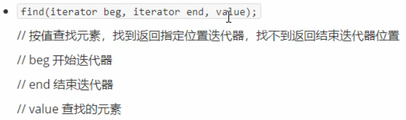

## 5.2 常用查找算法

算法简介：

.

### 5.2.1 find

- 查找指定元素，找到返回指定元素的迭代器，找不到返回结束迭代器end()

函数原型：

.

```c++
#include<iostream>
using namespace std;
#include<vector>
#include<algorithm>

//查找内置数据类型
void test03()
{
	vector<int>v;

	for (int i = 0; i < 10; i++)
	{
		v.push_back(i);
	}

	//查找容器中是否有5这个元素
	vector<int>::iterator it = find(v.begin(), v.end(), 5);
	if (it == v.end())
	{
		cout << "没有找到" << endl;
	}
	else
	{
		cout << "找到:" << *it << endl;
	}
}

class Person
{
public:
	Person(string name, int age)
	{
		this->name = name;
		this->age = age;
	}

	//重载 == 底层find知道如何对比person数据类型
	bool operator==(const Person& p)
	{
		if (this->name == p.name && this->age == p.age)
		{
			return true;
		}
		else
		{
			return false;
		}
	}

	string name;
	int age;
};

void test03_1()
{
	vector<Person>v;

	Person p1("aaa", 10);
	Person p2("bbb", 20);
	Person p3("ccc", 30);
	Person p4("ddd", 40);

	v.push_back(p1);
	v.push_back(p2);
	v.push_back(p3);
	v.push_back(p4);

	vector<Person>::iterator it = find(v.begin(), v.end(), p2);
	if (it == v.end())
	{
		cout << "没有找到" << endl;
	}
	else
	{
		cout << "找到元素 姓名:" << it->name << " 年龄:" << it->age << endl;
	}

}

int main(){
	
	test03();
	test03_1();
	
	system("pause");
	
	return 0;
}
```

### 5.2.2 find_if

- 按条件查找元素

函数原型：

.

```c++
#include<iostream>
using namespace std;
#include<vector>
#include<algorithm>

class GreatFive
{
public:
	bool operator()(int val)
	{
		return val > 5;
	}
};

void test04()
{
	vector<int>v;
	for (int i = 0; i < 10; i++)
	{
		v.push_back(i);
	}

	vector<int>::iterator it = find_if(v.begin(), v.end(), GreatFive());
	if (it == v.end())
	{
		cout << "没有找到" << endl;
	}
	else
	{
		cout << "找到:" << *it << endl;
	}
}

class Person
{
public:
	Person(string name, int age)
	{
		this->name = name;
		this->age = age;
	}

	string name;
	int age;
};

class Greater20
{
public:
	bool operator()(Person& p)
	{
		return p.age > 20;
	}
};

void test04_1()
{
	vector<Person>v;

	Person p1("aaa", 10);
	Person p2("bbb", 20);
	Person p3("ccc", 30);
	Person p4("ddd", 40);

	v.push_back(p1);
	v.push_back(p2);
	v.push_back(p3);
	v.push_back(p4);

	vector<Person>::iterator it =  find_if(v.begin(), v.end(), Greater20());
	if (it == v.end())
	{
		cout << "没有找到" << endl;
	}
	else
	{
		cout << "找到 姓名:" << it->name << " 年龄:" << it->age << endl;
	}
}

int main(){
	
	test04();
	test04_1();
	
	system("pause");
	
	return 0;
}
```

### 5.2.3 adjacent_find

- 查找相邻重复元素

函数原型：

.

```c++
#include<iostream>
using namespace std;
#include<vector>
#include<algorithm>

void test05()
{
	vector<int>v;
	v.push_back(0);
	v.push_back(2);
	v.push_back(0);
	v.push_back(3);
	v.push_back(3);
	v.push_back(1);
	v.push_back(4);
	v.push_back(3);
	v.push_back(0);

	vector<int>::iterator pos = adjacent_find(v.begin(), v.end());
	if (pos == v.end())
	{
		cout << "没有找到相邻重复元素" << endl;
	}
	else
	{
		cout << "找到:" << *pos << endl;
	}
}

int main(){
	
	test05();
	
	system("pause");
	
	return 0;
}
```

### 5.2.4 binary_search

- 查找指定元素是否存在

函数原型：

.

```c++
#include<iostream>
using namespace std;
#include<vector>
#include<algorithm>

void test06()
{
	vector<int>v;
	for (int i = 0; i < 10; i++)
	{
		v.push_back(i);
	}

	//二分查找容器是否有9元素
	//注意,容器必须是有序的序列
	bool ret = binary_search(v.begin(), v.end(),9);

	if (ret)
	{
		cout << "找到" << endl;
	}
	else
	{
		cout << "未找到" << endl;
	}
}

int main(){
	
	test06();
	
	system("pause");
	
	return 0;
}
```

### 5.2.5  count

- 统计元素个数

函数原型：

.

```c++
#include<iostream>
using namespace std;
#include<vector>
#include<algorithm>

//1.统计内置数据类型
void test07()
{
	vector<int>v;

	v.push_back(10);
	v.push_back(40);
	v.push_back(30);
	v.push_back(20);
	v.push_back(10);
	v.push_back(10);

	int num = count(v.begin(), v.end(), 10);

	cout << "10的元素个数为:" << num << endl;
}

class Person1
{
public:
	Person1(string name, int age)
	{
		this->name = name;
		this->age = age;
	}

	//重载 == 底层知道如何对比person数据类型
	bool operator==(const Person1& p)
	{
		if (this->age == p.age)
		{
			return true;
		}
		else
		{
			return false;
		}
	}

	string name;
	int age;
};

//2.统计自定义数据类型
void test07_1()
{
	vector<Person1>v;

	Person1 p1("刘备", 35);
	Person1 p2("关羽", 31);
	Person1 p3("张飞", 30);
	Person1 p4("赵云", 28);
	Person1 p5("黄忠", 35);

	v.push_back(p1);
	v.push_back(p2);
	v.push_back(p3);
	v.push_back(p4);
	v.push_back(p5);

	Person1 p("诸葛亮", 35);

	int num = count(v.begin(), v.end(), p);

	cout << "和诸葛亮同岁的人数个数为:" << num << endl;
}

int main(){
	
	test07();
	test07_1();
	
	system("pause");
	
	return 0;
}
```

### 5.2.6 count_if

- 按条件统计元素个数

函数原型：

.

```c++
#include<iostream>
using namespace std;
#include<vector>
#include<algorithm>

class Greater20
{
public:
	bool operator()(int val)
	{
		return val > 20;
	}
};

void test08()
{
	vector<int>v;
	v.push_back(10);
	v.push_back(20);
	v.push_back(40);
	v.push_back(30);
	v.push_back(20);
	v.push_back(50);
	v.push_back(30);
	v.push_back(40);

	int num = count_if(v.begin(), v.end(), Greater20());

	cout << "大于20的个数为:" << num << endl;
}

class Person2
{
public:
	Person2(string name, int age)
	{
		this->name = name;
		this->age = age;
	}

	string name;
	int age;
};

class AgeGreater20
{
public:
	bool operator()(const Person2& p)
	{
		return p.age > 30;
	}
};

void test08_1()
{
	vector<Person2>v;

	Person2 p1("刘备", 35);
	Person2 p2("关羽", 31);
	Person2 p3("张飞", 30);
	Person2 p4("赵云", 28);
	Person2 p5("黄忠", 35);

	v.push_back(p1);
	v.push_back(p2);
	v.push_back(p3);
	v.push_back(p4);
	v.push_back(p5);

	int num = count_if(v.begin(), v.end(), AgeGreater20());

	cout << "大于20岁人员的个数为:" << num << endl;
}

int main(){
	
	test08();
	test08_1();
	
	system("pause");
	
	return 0;
}
```

