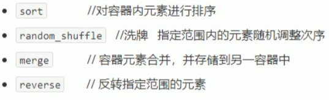
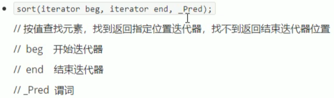
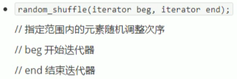
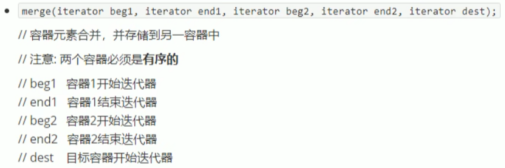
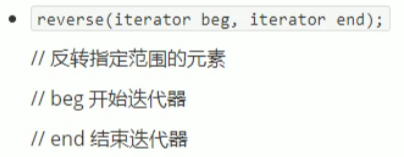

## 5.3 常用排序算法

- 掌握常用的排序算法

算法简介：

.


### 5.3.1 sort

- 对容器内元素进行排序

函数原型：

.

```c++
#include<iostream>
using namespace std;
#include<vector>
#include<algorithm>
#include<functional>

void myPrint(int val)
{
	cout << val << " ";
}

void test01()
{
	vector<int>v;

	v.push_back(10);
	v.push_back(30);
	v.push_back(40);
	v.push_back(20);
	v.push_back(50);

	//利用sort进行升序
	sort(v.begin(), v.end());
	for_each(v.begin(), v.end(), myPrint);
	cout << endl;

	//改变为 降序
	sort(v.begin(), v.end(), greater<int>());
	for_each(v.begin(), v.end(), myPrint);
	cout << endl;
}

int main(){
	
	test01();
	
	system("pause");
	
	return 0;
}

```

### 5.3.2 random_shuffle

- 指定范围内的元素随机调整次序

函数原型:

.

```c++
#include<iostream>
using namespace std;
#include<vector>
#include<algorithm>
#include<functional>
#include<ctime>

void myPrint1(int val)
{
	cout << val << " ";
}

void test02()
{
	vector<int>v;
	for (int i = 0; i < 10; i++)
	{
		v.push_back(i);
	}

	//利用洗牌 算法 打乱顺序
	random_shuffle(v.begin(), v.end());
	for_each(v.begin(), v.end(), myPrint1);
	cout << endl;
}

int main(){

	srand((unsigned int)time(NULL));
	
	test02();
	
	system("pause");
	
	return 0;
}
```

### 5.3.3 merge

- 两个容器元素合并,并存储到另一个容器中

函数原型:



```c++
#include<iostream>
using namespace std;
#include<vector>
#include<algorithm>
#include<functional>

void myPrint2(int val)
{
	cout << val << " ";
}

void test03()
{
	vector<int>v1;
	vector<int>v2;

	for (int i = 0; i < 10; i++)
	{
		v1.push_back(i);
		v2.push_back(i+1);
	}

	//目标容器
	vector<int>vt;
	vt.resize(v1.size() + v2.size());

	merge(v1.begin(), v1.end(), v2.begin(), v2.end(), vt.begin());
	for_each(vt.begin(), vt.end(),myPrint2);
	cout << endl;
}

int main(){
	
	test03();
	
	system("pause");
	
	return 0;
}
```

### 5.3.4 reverse

- 将容器内元素进行反转

函数原型:

.

```c++
#include<iostream>
using namespace std;
#include<vector>
#include<algorithm>

void myPrint4(int val)
{
	cout << val << " ";
}

void test04()
{
	vector<int>v;

	v.push_back(10);
	v.push_back(30);
	v.push_back(50);
	v.push_back(20);
	v.push_back(40);

	for_each(v.begin(), v.end(), myPrint4);
	cout << endl;

	reverse(v.begin(), v.end());
	for_each(v.begin(), v.end(), myPrint4);
	cout << endl;
}

int main(){

	test04();
	
	system("pause");
	
	return 0;
}
```

