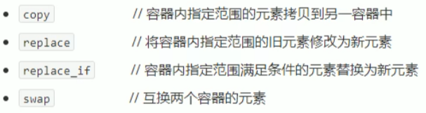
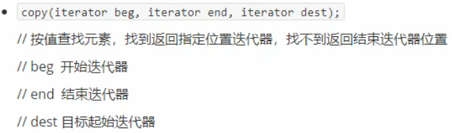
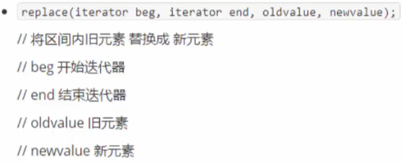
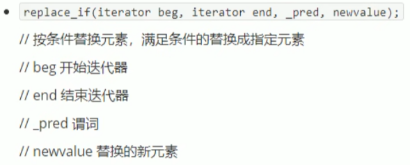
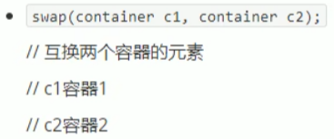

## 5.4 常用拷贝和替换算法

算法简介:

.

### 5.4.1 copy

- 容器内指定范围的元素拷贝到另一个容器中

函数原型:

.

```
#include<iostream>
using namespace std;
#include<vector>
#include<algorithm>

void myPrint5(int val)
{
	cout << val << " ";
}

void test05()
{
	vector<int>v1;
	for (int i = 0; i < 10; i++)
	{
		v1.push_back(i);
	}

	vector<int>v2;
	v2.resize(v1.size());

	copy(v1.begin(), v1.end(), v2.begin());
	for_each(v2.begin(), v2.end(), myPrint5);
	cout << endl;
}

int main(){
	
	test05();
	
	system("pause");
	
	return 0;
}
```

### 5.4.2 replace

- 将容器内指定范围的旧元素改为新元素

函数原型:

.

```c++
#include<iostream>
using namespace std;
#include<vector>
#include<algorithm>

class MyPrint
{
public:
	void operator()(int val)
	{
		cout << val << " ";
	}
};

void test06()
{
	vector<int>v;
	v.push_back(20);
	v.push_back(30);
	v.push_back(10);
	v.push_back(20);
	v.push_back(50);
	v.push_back(40);
	v.push_back(20);

	cout << "替换前：" << endl;
	for_each(v.begin(), v.end(), MyPrint());
	cout << endl;

	cout << "替换后：" << endl;
	//将20替换为2000
	replace(v.begin(), v.end(), 20, 2000);
	for_each(v.begin(), v.end(), MyPrint());
	cout << endl;
}

int main(){
	
	test06();
	
	system("pause");
	
	return 0;
}
```

### 5.4.3 replace_if

- 将区间内满足条件的元素,替换成指定元素

函数原型:

.

```c++
#include<iostream>
using namespace std;
#include<vector>
#include<algorithm>

class MyPrint
{
public:
	void operator()(int val)
	{
		cout << val << " ";
	}
};
class Greater30
{
public:
	bool operator()(int val)
	{
		return val > 30;
	}
};

void test07()
{
	vector<int>v;
	v.push_back(10);
	v.push_back(40);
	v.push_back(30);
	v.push_back(50);
	v.push_back(20);
	v.push_back(30);
	v.push_back(40);

	//将大于等于30 替换为3000
	cout << "替换前：" << endl;
	for_each(v.begin(), v.end(), MyPrint());
	cout << endl;

	cout << "替换后：" << endl;
	replace_if(v.begin(), v.end(), Greater30(), 3000);
	for_each(v.begin(), v.end(), MyPrint());
	cout << endl;
}

int main(){
	
	test07();
	
	system("pause");
	
	return 0;
}
```

### 5.4.4 swap

- 互换两个容器的元素

函数原型:

.

```c++
#include<iostream>
using namespace std;
#include<vector>
#include<algorithm>

void myPrint8(int val)
{
	cout << val << " ";
}

void test08()
{
	vector<int>v1;
	vector<int>v2;

	for (int i = 0; i < 10; i++)
	{
		v1.push_back(i);
		v2.push_back(i + 100);
	}

	cout << "交换前：" << endl;
	for_each(v1.begin(), v1.end(), myPrint8);
	cout << endl;
	for_each(v2.begin(), v2.end(), myPrint8);
	cout << endl;

	cout << "交换后：" << endl;
	swap(v1, v2);
	for_each(v1.begin(), v1.end(), myPrint8);
	cout << endl;
	for_each(v2.begin(), v2.end(), myPrint8);
	cout << endl;
}

int main(){
	
	test08();
	
	system("pause");
	
	return 0;
}
```

