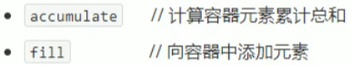
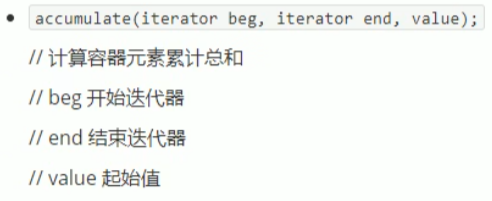
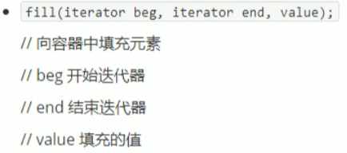

## 5.5 常用算术生成算法

- 掌握常用的算术生成算法

注意:

- 算术生成算法属于小型算法，使用时包含的头文件为#include<numeric>

算法简介：

.

### 

### 5.5.1 accumulate

- 计算区间内 容器元素累加总和

函数原型：

.

```c++
#include<iostream>
using namespace std;
#include<vector>
#include<numeric>

void test01()
{
	vector<int>v;

	for (int i = 0; i <= 100; i++)
	{
		v.push_back(i);
	}

	//参数3 起始累加值
	int total = accumulate(v.begin(), v.end(),1000);
	cout << "total = " << total << endl;

}

int main(){

	test01();
	
	system("pause");
	
	return 0;
}
```

### 5.5.2 fill

- 向容器中填充指定的元素

函数原型：

.

```c++
#include<iostream>
using namespace std;
#include<vector>
#include<numeric>
#include<algorithm>

void myPrint(int val)
{
	cout << val << " ";
}

void test02()
{
	vector<int>v;
	v.resize(10);
	
	//后期重新填充
	fill(v.begin(), v.end(), 100);

	for_each(v.begin(), v.end(), myPrint);
	cout << endl;
}

int main(){
	
	test02();

	system("pause");
	
	return 0;
}
```

