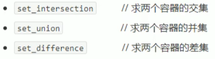
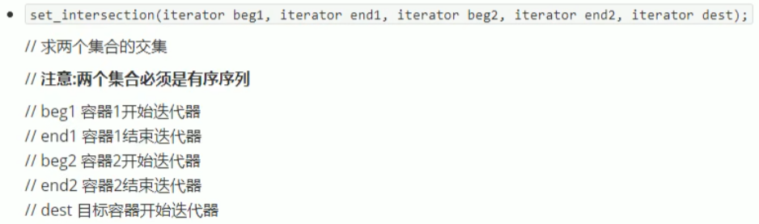
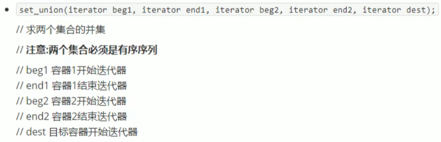
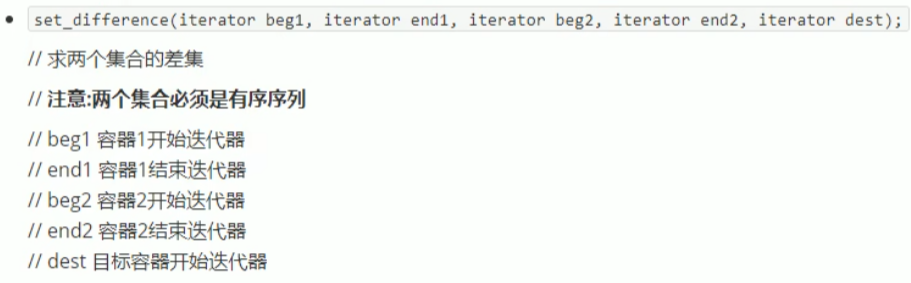

## 5.6 常用集合算法

算法简介：

.

### 5.6.1 set_intersection

- 求两个容器的交集

函数原型：



```c++
#include<iostream>
using namespace std;
#include<vector>
#include<algorithm>


void myPrint2(int val)
{
	cout << val << " ";
}

void test03()
{
	vector<int>v1;
	vector<int>v2;
	for (int i = 0; i < 10; i++)
	{
		v1.push_back(i);
		v2.push_back(i+5);
	}

	vector<int>vt;
	//目标容器需要提前开辟空间
	//最特殊情况 大容器包含小容器 开辟空间 取小容器的size即可
	vt.resize(min(v1.size(), v2.size()));
	
	//获取交集
	vector<int>::iterator itEnd = set_intersection(v1.begin(), v1.end(), v2.begin(), v2.end(), vt.begin());
	for_each(vt.begin(), itEnd, myPrint2);
	cout << endl;

}

int main(){
	
	test03();
	
	system("pause");
	
	return 0;
}
```

### 5.6.2 set_union

- 求两个集合的并集

函数原型：



```c++
#include<iostream>
using namespace std;
#include<vector>
#include<algorithm>

void myPrint4(int val)
{
	cout << val << " ";
}

void test04()
{
	vector<int>v1;
	vector<int>v2;
	for (int i = 0; i < 10; i++)
	{
		v1.push_back(i);
		v2.push_back(i + 5);
	}

	vector<int>vt;
	//目标容器提前开辟空间
	vt.resize(v1.size() + v2.size());
	vector<int>::iterator itEnd = set_union(v1.begin(), v1.end(), v2.begin(), v2.end(), vt.begin());
	for_each(vt.begin(), itEnd, myPrint4);
	cout << endl;

}

int main(){
	
	test04();
	
	system("pause");
	
	return 0;
}
```

### 5.6.3 set_difference

- 求两个集合的差集

函数原型：



````c++
#include<iostream>
using namespace std;
#include<vector>
#include<algorithm>

void myPrint5(int val)
{
	cout << val << " ";
}

void test05()
{
	vector<int>v1;
	vector<int>v2;
	for (int i = 0; i < 10; i++)
	{
		v1.push_back(i);
		v2.push_back(i + 5);
	}

	//创建目标容器
	vector<int>vt;
	vt.resize(max(v1.size(), v2.size()));

	cout << "v1和v2的差集为：" << endl;
	vector<int>::iterator itEnd = set_difference(v1.begin(), v1.end(), v2.begin(), v2.end(), vt.begin());
	for_each(vt.begin(), itEnd, myPrint5);
	cout << endl;

	cout << "v2和v1的差集为：" << endl;
	itEnd = set_difference(v2.begin(), v2.end(), v1.begin(), v1.end(), vt.begin());
	for_each(vt.begin(), itEnd, myPrint5);
	cout << endl;
}

int main(){
	
	test05();
	
	system("pause");
	
	return 0;
}
````

