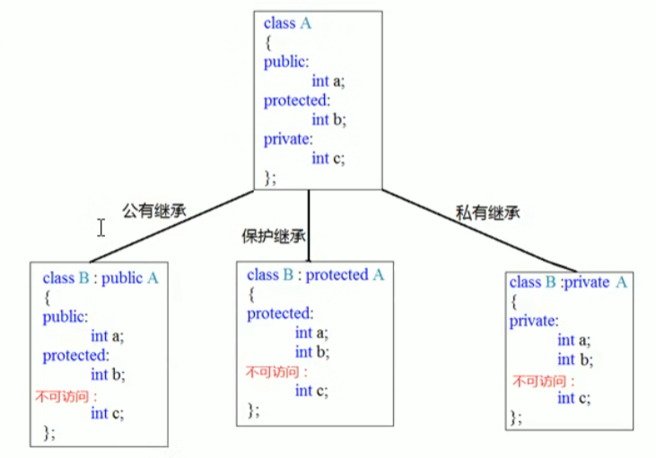

### 4.6.2 继承方式

继承方式一共有三种：

- 公共继承
- 保护继承
- 私有继承



```c++
#include<iostream>
using namespace std;

//公共继承
class Base1
{
public:
	int A;
protected:
	int B;
private:
	int C;
};

class Son1 :public Base1
{
public:
	void func()
	{
		A = 10;		//父类中的公共权限成员 到子类中依然是公共权限
		B = 10;		//父类中的保护权限成员 到子类中依然是保护权限
		//C = 10;		//父类中的私有权限成员 子类访问不到
	}
};

void test02()
{
	Son1 s1;
	s1.A = 100;
	//s1.B = 100;		//到Son1中B是保护权限 类外访问不到
}

//保护继承
class Base2
{
public:
	int A;
protected:
	int B;
private:
	int C;
};

class Son2 :protected Base2
{
public:
	void func()
	{
		A = 10;		//父类中的公共权限成员 到子类中变为保护权限
		B = 10;		//父类中的保护权限成员 到子类中依然是保护权限
		//C = 10;		//父类中的私有权限成员 子类访问不到
	}
};

void test02_1()
{
	Son2 s2;
	//s2.A = 100;		//在Son2中A变为保护权限 因此类外访问不到
	//s1.B = 100;		//到Son2中B是保护权限 类外访问不到
}

//私有继承
class Base3
{
public:
	int A;
protected:
	int B;
private:
	int C;
};

class Son3 :private Base3
{
public:
	void func()
	{
		A = 10;		//父类中的公共权限成员 到子类中变为私有成员
		B = 10;		//父类中的保护权限成员 到子类中变为私有成员
		//C = 10;		//父类中的私有权限成员 子类访问不到
	}
};

class GrandSon3 :public Son3
{
public:
	void func()
	{
		//A = 100;		//到Son3中A变为私有，即使是Son3的儿子，也访问不到
		//B = 10;		//到Son3中B变为私有，即使是Son3的儿子，也访问不到
	}
};

void test02_2()
{
	Son3 s3;
	//s2.A = 100;		//在Son2中A变为私有权限 因此类外访问不到
	//s1.B = 100;		//在Son2中B变为私有权限 类外访问不到
}

int main(){
	
	
	system("pause");
	
	return 0;
}
```

